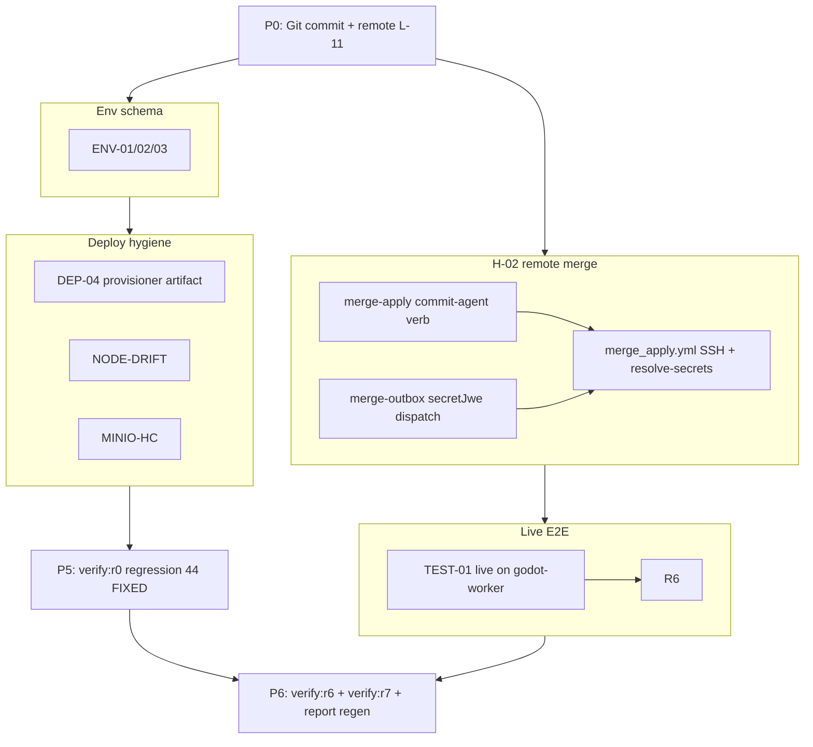

# VMCP (Vibrato PGOS) — Exhaustive Remediation Implementation Plan v3.0

**Source audit:** `report.md` (2026-07-12, post–v2.0 working-tree audit)  
**Project path:** `C:\Users\makem\Desktop\VMCP`  
**Plan version:** 3.0  
**Scope:** Close **all** gaps in `report.md` — **13** items require implementation or operator action; **44** canonical findings require regression verification gates. **No shortcuts.**

This plan **supersedes v2.0**. v2.0 closed the original 51-finding remediation in the working tree; v3.0 closes the **residual release blockers** documented in the regenerated audit.

---

## Plan revision history

| Ver | Change |
| --- | --- |
| 1.0 | Initial plan from first audit |
| 1.1 | Plan hardening (ForcedCommand, heartbeat, DISPATCH_FAILED, topology) |
| 2.0 | Post-remediation plan: 35 FIXED regression + 16 OPEN/PARTIAL implementation |
| **3.0** | **Post–report.md audit:** GIT-UNCOMMITTED, H-02 remote merge, TEST-01 live E2E, L-11 remote, ENV-*, DEP-04, NODE-DRIFT, hygiene + full regression matrix |

---

## Table of Contents

1. [Executive Summary](#1-executive-summary)
2. [Finding Status Matrix](#2-finding-status-matrix)
3. [Prerequisites & Baseline](#3-prerequisites--baseline)
4. [Dependency Graph](#4-dependency-graph)
5. [Phase P0 — Git Foundation & Commit Remediation](#5-phase-p0--git-foundation--commit-remediation)
6. [Phase P1 — H-02 Remote Structural Merge (Complete)](#6-phase-p1--h-02-remote-structural-merge-complete)
7. [Phase P2 — TEST-01 Live Cross-Machine E2E](#7-phase-p2--test-01-live-cross-machine-e2e)
8. [Phase P3 — Environment & Schema Alignment](#8-phase-p3--environment--schema-alignment)
9. [Phase P4 — Deployment Artifacts & Hygiene](#9-phase-p4--deployment-artifacts--hygiene)
10. [Phase P5 — Regression Verification (44 FIXED)](#10-phase-p5--regression-verification-44-fixed)
11. [Phase P6 — Final Gate & Report Closure](#11-phase-p6--final-gate--report-closure)
12. [Master Verification Matrix](#12-master-verification-matrix)
13. [Rollout & Risk Controls](#13-rollout--risk-controls)
14. [Appendix A — File Touch Index](#appendix-a--file-touch-index)
15. [Appendix B — Acceptance Criteria Closure](#appendix-b--acceptance-criteria-closure)
16. [Appendix C — Plan Correctness Constraints](#appendix-c--plan-correctness-constraints)

---

## 1. Executive Summary

### Audit posture (report.md 2026-07-12)

| Metric | Count |
| --- | --- |
| Canonical findings (report §2) | 51 |
| New findings (report §3) | 6 |
| **FIXED** (regression only) | 44 |
| **PARTIAL** (complete implementation) | 5 |
| **OPEN** (implement or operator-activate) | 8 |
| **Work items in this plan** | **13** |

### What blocks production cross-machine today

1. **GIT-UNCOMMITTED** — ~170 files on disk; HEAD `ac5ef96` predates v2.0 remediation.
2. **H-02 / H-02-MERGE-VERB / H-02-WORKFLOW-SSH** — Remote merge outbox dispatches `merge_apply.yml` but commit-agent lacks `merge-apply` verb; workflow lacks JWE/SSH wiring.
3. **TEST-01** — Automated 7/7 ✅; **mandatory live** cross-machine evidence on `godot-worker` not yet required by gates.
4. **L-11** — No `git remote`; CI and branch protection never run on a host repo.

### Success criteria (project-level)

1. All **57** tracked IDs ✅ in §12 matrix (FIXED re-verified; OPEN/PARTIAL closed with evidence).
2. `git log` on `main` contains v2.0 + v3.0 remediation; `git remote -v` shows `origin`.
3. `npm run verify:r0` through `verify:r6` and new `verify:r7` exit 0.
4. Live TEST-01 log committed under `docs/e2e/` (secrets redacted).
5. `report.md` regenerated showing **0 OPEN Critical** and **0 OPEN High**.
6. README / AGENTS.md acceptance criteria honest for **remote** merge apply (not co-located only).

---

## 2. Finding Status Matrix

### Requires implementation or operator action (13)

| ID | Severity | Status (report) | Phase | Owner |
| --- | --- | --- | --- | --- |
| GIT-UNCOMMITTED | Critical | OPEN | P0 | Dev |
| L-11 | Low | PARTIAL | P0 | Dev + Operator |
| H-02 | High | PARTIAL | P1 | Dev |
| H-02-MERGE-VERB | High | OPEN | P1 | Dev |
| H-02-WORKFLOW-SSH | High | OPEN | P1 | Dev |
| TEST-01 | High | PARTIAL | P2 | Dev + Operator |
| ENV-01 | Medium | OPEN | P3 | Dev |
| ENV-02 | Medium | OPEN | P3 | Dev |
| ENV-03 | Low | OPEN | P3 | Dev |
| DEP-04 | Medium | PARTIAL | P4 | Dev |
| NODE-DRIFT | Low | OPEN | P4 | Dev |
| MINIO-HC | Low | OPEN | P4 | Dev |
| DOC-PLAN-DRIFT | Medium | OPEN | P6 | Dev |

### Regression verification only (44 FIXED)

C-00, C-01, C-02, C-03, C-04, C-05, C-06, DEP-01, H-01, H-03, H-04, H-05, H-06, H-07, H-08, H-09, H-10, H-11, H-12, H-13, H-14, M-01–M-18, TEST-02, TEST-03, SEC-01, SEC-02, CM-LOCK-01, DEP-02, DEP-03, L-01–L-10, L-12, DOC-01, DOC-02.

\*H-03 marked FIXED with co-location caveat; P1 adds explicit SSH path for `uid_reconcile.yml` when runner tree unreadable (optional hardening, see §6.4).

---

## 3. Prerequisites & Baseline

### 3.1 Environment requirements

| Requirement | Purpose |
| --- | --- |
| Node.js ≥ 20 (`.nvmrc` = `20`) | Monorepo build/test |
| Go ≥ 1.22 | commit-agent + target-provisioner |
| Docker + Compose | Local integration |
| `shellcheck` | Worker script CI |
| Git + GitHub hosting | L-11 push + CI |
| Self-hosted `godot-worker` runner (Tier A) | TEST-01 live + merge_apply remote |
| Target host with commit-agent + provisioner + Godot | Cross-machine E2E |
| Godot 4.3+ on runner and target | Generation + reimport |

### 3.2 Baseline verification (gate before any code changes)

Record outputs in `docs/remediation/P0-baseline-<date>.log` (gitignored; commit only summary):

```bash
cd C:\Users\makem\Desktop\VMCP
npm run typecheck
npm run lint
npm test
npm run build
cd packages/commit-agent && go test ./... -count=1 && cd ../..
cd packages/target-provisioner && go test ./... -count=1 && cd ../..
node scripts/verify-workflow-mirrors.mjs
npm run verify:r1
npm run verify:r2
npm run verify:r3
npm run verify:r4
npm run verify:r5
```

**Gate:** All must pass as documented in `report.md` §Executive Summary. Failures block phase start.

**Expected today:** R2 passes static H-02 checks but **does not** prove remote SSH merge; P1 extends R2/R7.

### 3.3 Branching strategy

1. Branch from current working tree: `remediation/v3-report-2026-07-12`
2. **P0 first:** commit existing v2.0 tree in logical chunks (see §5.2) before P1 code.
3. One PR per phase (P0–P6) or per finding ID where review surface is large.
4. Each PR: code + tests + doc updates + mirror sync (if workflow touched).
5. Stack order per §4 dependency graph.

### 3.4 Known tree facts (do not re-implement)

| Item | State |
| --- | --- |
| Cross-machine client protocol | ✅ C-00 verbs in workers + commit-agent |
| `DISPATCH_FAILED` | ✅ Migration 003 + FSM |
| `snapshot-export` / C-03 | ✅ commit-agent + worker smokes |
| DEP-01 target-provisioner | ✅ In-repo Go service |
| Dashboard Projects/RBAC | ✅ H-06/H-07 |
| Error catalog E001–E021 | ✅ M-13 tests |
| Automated TEST-01 7/7 | ✅ `docs/e2e/cross-machine-e2e-summary.md` |
| `report.md` | ✅ Populated (DOC-01) |

---

## 4. Dependency Graph



**Rules:**

1. **P0** before push-triggered CI — otherwise remediation never runs on GitHub.
2. **P1** before claiming H-02 FIXED in report — remote merge is the highest technical risk.
3. **P2** after P1 — live E2E should exercise merge-outbox remote path if scenario 8 added.
4. **P3** can parallelize with P1 after P0 commit.
5. **P5** runs after all implementation phases; do not skip FIXED regression even when "obvious."
6. **P6** is the only phase that may regenerate `report.md` closure claims.

---

## 5. Phase P0 — Git Foundation & Commit Remediation

**Targets:** GIT-UNCOMMITTED, L-11 (operator), DOC-PLAN-DRIFT (partial)

### 5.1 — P0.1 Pre-commit baseline capture

| Step | Action | Verification |
| --- | --- | --- |
| 5.1.1 | Run §3.2 baseline suite | All green |
| 5.1.2 | Write `docs/remediation/P0-baseline-summary.md` with test counts (294 npm, Go suites) | File committed |
| 5.1.3 | Snapshot `git status --short \| wc -l` → expect ~170 | Recorded in summary |

### 5.2 — P0.2 Logical commit stack (GIT-UNCOMMITTED)

Commit the **existing v2.0 working tree** in reviewable chunks. Suggested order (adjust if conflicts):

| Commit # | Scope | Paths (representative) |
| --- | --- | --- |
| 1 | Shared + errors E021 | `packages/shared/`, `docs/errors/E021.md` |
| 2 | Orchestrator core services | `packages/orchestrator/src/services/`, `src/routes/`, migrations |
| 3 | Orchestrator workers + tests | `packages/orchestrator/src/workers/`, `tests/` |
| 4 | Dashboard + RBAC pages | `packages/dashboard/` |
| 5 | Sandbox + MCP | `packages/sandbox-service/`, `packages/mcp-server/` |
| 6 | commit-agent + C-03/C-04 | `packages/commit-agent/` |
| 7 | target-provisioner DEP-01 | `packages/target-provisioner/` |
| 8 | Workers scripts + tests | `workers/scripts/`, `workers/tests/` |
| 9 | Workflows + mirrors | `.github/workflows/`, `workers/.github/workflows/` |
| 10 | Verify scripts + e2e docs | `scripts/verify-*.mjs`, `scripts/run-cross-machine-e2e.mjs`, `docs/e2e/`, `docs/remediation/` |
| 11 | Deploy docs + compose + railway | `docs/deploy/`, `docker-compose.yml`, `railway.toml`, `LICENSE` |
| 12 | Root docs | `README.md`, `AGENTS.md`, `report.md`, `plan.md`, `.env.example`, `package.json` |

**Per-commit gate:**

```bash
npm run typecheck && npm test && node scripts/verify-workflow-mirrors.mjs
```

**Definition of Done (GIT-UNCOMMITTED):**

- [ ] `git status --short` empty on branch
- [ ] `git log --oneline -12` shows stacked remediation commits
- [ ] No secrets in committed files (grep `BEGIN.*PRIVATE`, `change-me` only in `.env.example`)

### 5.3 — P0.3 Git remote & branch protection (L-11)

| Step | Action | Verification |
| --- | --- | --- |
| 5.3.1 | Create empty GitHub repo `<org>/VMCP` (or equivalent) | Repo exists |
| 5.3.2 | `export PGOS_GIT_ORIGIN='https://github.com/<org>/<repo>.git'` | |
| 5.3.3 | `bash scripts/configure-git-remote.sh` | `git remote -v` shows `origin` |
| 5.3.4 | `PGOS_GIT_PUSH=1 bash scripts/configure-git-remote.sh` (or manual `git push -u origin main`) | Remote `main` matches local |
| 5.3.5 | Apply branch protection per `docs/deploy/git-hosting.md` | Require CI green; no force-push |
| 5.3.6 | Confirm `.github/workflows/ci.yml` runs on push | Green CI on `main` |

**Definition of Done (L-11):**

- [ ] `git remote -v` non-empty
- [ ] GitHub Actions CI green on `main`
- [ ] Branch protection enabled (screenshot or `gh api` output archived in `docs/remediation/L11-branch-protection.txt`)

---

## 6. Phase P1 — H-02 Remote Structural Merge (Complete)

**Targets:** H-02, H-02-MERGE-VERB, H-02-WORKFLOW-SSH

**Design decision (signed):** Implement **Option A** — full remote path via commit-agent `merge-apply` verb + JWE dispatch (mirrors `godot_worker.yml` secret pattern). Do **not** downgrade to co-location-only documentation.

### 6.1 — P1.1 commit-agent `merge-apply` verb (H-02-MERGE-VERB)

**Contract:**

```text
merge-apply <project_root> <rel_path>   # JSON patch on stdin (same schema as POST /merge patch)
```

**Behavior:**

1. Validate `project_root` + `rel_path` under allowed root (`internal/paths` — same as other verbs).
2. Read patch JSON from stdin (max size cap, e.g. 1 MiB).
3. Apply structural merge on target host:
   - **Preferred:** invoke bundled `tscn-merge` logic — port minimal merge from `workers/scripts/lib/tscn-merge.mjs` to Go **or** shell out to `node` if installed on target (document in commit-agent README).
   - **Minimum acceptable:** copy `tscn-merge.mjs` to target via install.sh `share/` dir and `node` subprocess with temp patch file.
4. Atomic write: `*.pgos-merge-<pid>` → `rename` (same as local `merge-apply.sh`).
5. stdout: single JSON line `{"ok":true,"mergedHash":"<sha256>","path":"<rel>"}`.
6. stderr only on failure; exit non-zero with E014-class message.

| Step | File | Action |
| --- | --- | --- |
| 6.1.1 | `packages/commit-agent/cmd/agent/main.go` | Add `cmdMergeApply = "merge-apply"`; document in header comment |
| 6.1.2 | `packages/commit-agent/cmd/agent/main.go` | `handleArgs` branch → `runMergeApply(projectRoot, relPath, stdin)` |
| 6.1.3 | `packages/commit-agent/cmd/agent/merge_apply.go` (new) | Implement merge + hash + atomic rename |
| 6.1.4 | `packages/commit-agent/cmd/agent/merge_apply_test.go` (new) | Unit tests: happy path, bad path, E019 script patch reject |
| 6.1.5 | `packages/commit-agent/cmd/agent/integration_test.go` | Add `TestIntegration_MergeApply` |
| 6.1.6 | `packages/commit-agent/scripts/install.sh` | Install `tscn-merge.mjs` to `/usr/share/pgos/tscn-merge.mjs` (or embed) |
| 6.1.7 | `packages/commit-agent/README.md` | Document verb + ForcedCommand example |

**Tests:**

```bash
cd packages/commit-agent && go test ./... -count=1 -run MergeApply
```

### 6.2 — P1.2 Orchestrator dispatch envelope (H-02)

Merge apply workflow needs SSH material when `project_root` is not on Tier A runner.

| Step | File | Action |
| --- | --- | --- |
| 6.2.1 | `packages/orchestrator/src/services/merge-outbox-dispatch.ts` (new) | `buildMergeApplyDispatchEnvelope(project, row)` → `{ secretJwe, targetHost, projectRoot, ... }` |
| 6.2.2 | Envelope payload | Include: `TARGET_HOST`, `SSH_PRIVATE_KEY` (from provision), `PGOS_BASE_URL`, `OUTBOX_ID`, `REL_PATH`, `PATCH_GET_URL`, `PROJECT_ROOT`, `CALLBACK_TOKEN` or service token ref |
| 6.2.3 | `packages/orchestrator/src/workers/merge-outbox-worker.ts` | Replace bare `dispatchMergeApply({ outboxId, ... })` with envelope + `secretJwe` input |
| 6.2.4 | `packages/orchestrator/src/services/secret-service.ts` | Reuse `createDispatchJwe` pattern from job-service (no new crypto) |
| 6.2.5 | `packages/orchestrator/tests/merge-outbox-worker.test.ts` | Assert dispatch inputs include `secretJwe` when remote |
| 6.2.6 | `packages/orchestrator/tests/merge-outbox-dispatch.test.ts` (new) | Envelope field completeness |

**Constraint:** Never put raw private keys in workflow_dispatch inputs — **JWE only** (same as C-06 / M-07).

### 6.3 — P1.3 `merge_apply.yml` SSH wiring (H-02-WORKFLOW-SSH)

Mirror `godot_worker.yml` resolve-secrets pattern.

| Step | File | Action |
| --- | --- | --- |
| 6.3.1 | `.github/workflows/merge_apply.yml` | Add `secretJwe` required input |
| 6.3.2 | Same | Add step: `bash workers/scripts/resolve-secrets.sh` with `SECRET_JWE` env |
| 6.3.3 | Same | After resolve: export `TARGET_HOST`, `PROJECT_ROOT`, `REL_PATH`, `PATCH_GET_URL`, `OUTBOX_ID`, `CALLBACK_TOKEN` / `PGOS_SERVICE_TOKEN` from resolved map |
| 6.3.4 | Same | `runs-on: [self-hosted, godot-worker]` (already present) |
| 6.3.5 | `workers/scripts/merge-apply.sh` | When `PROJECT_ROOT` not local dir: require `TARGET_HOST`; use `pgos_ssh_agent_stdin "merge-apply …"` |
| 6.3.6 | `workers/scripts/merge-apply.sh` | On remote success: POST `/api/v1/merge-outbox/:id/complete` with `mergedHash` from agent JSON stdout |
| 6.3.7 | `workers/.github/workflows/merge_apply.yml` | Mirror sync |
| 6.3.8 | `node scripts/verify-workflow-mirrors.mjs` | Pass |

**GitHub secrets (document in `workers/README.md`):**

| Secret | Purpose |
| --- | --- |
| `PGOS_BASE_URL` | Orchestrator URL |
| `PGOS_SERVICE_TOKEN` | Merge outbox complete callback (ENV-02) |

### 6.4 — P1.4 Worker smokes & verify gate extension

| Step | File | Action |
| --- | --- | --- |
| 6.4.1 | `workers/tests/merge-apply-remote-smoke.sh` (new) | Mock `pgos_ssh_agent_stdin` + fake agent JSON; assert complete callback shape |
| 6.4.2 | `workers/tests/merge-apply-verb-smoke.sh` (new) | Run commit-agent `-once "merge-apply …"` against fixture tree |
| 6.4.3 | `.github/workflows/ci.yml` | Add both smokes |
| 6.4.4 | `scripts/verify-r7-h02-remote-merge.mjs` (new) | Static + smoke gate for P1 DoD |
| 6.4.5 | `package.json` | `"verify:r7": "node scripts/verify-r7-h02-remote-merge.mjs"` |
| 6.4.6 | `scripts/verify-r2-high-partial-completion.mjs` | Add checks: `merge-apply` in main.go, `secretJwe` in merge_apply.yml, envelope module exists |
| 6.4.7 | `scripts/verify-r6-e2e-gate.mjs` | Invoke `verify:r7` before closure |

**verify:r7 minimum checks (implement in script):**

1. `main.go` contains `merge-apply` command constant and handler.
2. `merge_apply.yml` contains `secretJwe` input + `resolve-secrets.sh` step.
3. `merge-outbox-worker.ts` passes `secretJwe` in remote dispatch path.
4. `merge-apply-remote-smoke.sh` exits 0.
5. `merge-apply-verb-smoke.sh` exits 0.
6. `go test ./... -count=1` in commit-agent green.

### 6.5 — P1.5 Documentation updates

| File | Update |
| --- | --- |
| `README.md` | Acceptance criteria: remote merge via outbox + `merge_apply.yml` + commit-agent verb |
| `AGENTS.md` | Structural merge §: remote apply path explicit |
| `workers/README.md` | merge_apply secrets table + TARGET_HOST from JWE |
| `docs/errors/E014.md` | Note merge-apply failures |

### 6.6 — P1 Definition of Done

- [ ] `merge-apply` verb in commit-agent with tests
- [ ] Remote dispatch uses JWE only (no raw SSH in workflow inputs)
- [ ] `merge_apply.yml` resolve-secrets + apply on remote target
- [ ] `npm run verify:r7` exits 0
- [ ] `npm run verify:r2` still exits 0 (extended checks)
- [ ] H-02, H-02-MERGE-VERB, H-02-WORKFLOW-SSH → **FIXED** in §12 matrix

### 6.7 — Optional hardening (H-03 parity, not blocking)

If Tier A runner lacks co-located `PROJECT_ROOT` for UID reconcile:

| Step | Action |
| --- | --- |
| 6.7.1 | Add `secretJwe` to `uid_reconcile.yml` dispatch from `uid-remote-dispatch.ts` |
| 6.7.2 | SSH `uid-reconcile.sh` on target via commit-agent or remote script |

Track as **H-03-SSH** in §12 if implemented; otherwise document co-location requirement in `workers/README.md`.

---

## 7. Phase P2 — TEST-01 Live Cross-Machine E2E

**Target:** TEST-01 (close PARTIAL → FIXED with mandatory live evidence)

### 7.1 — P2.1 Infrastructure prerequisites

| Requirement | Verification |
| --- | --- |
| Tier A runner online (`godot-worker` label) | `gh runner list` or org settings |
| Target host reachable from runner | SSH test |
| commit-agent + provisioner installed on target | `install.sh` + provisioner health |
| Godot exact version on runner + target | `verify-godot.sh` |
| GitHub secrets: `PGOS_BASE_URL`, `PGOS_ADMIN_TOKEN`, `PGOS_SERVICE_TOKEN`, GitHub App creds on orchestrator | Checklist in `docs/e2e/cross-machine-e2e.md` |

### 7.2 — P2.2 Extend scenario driver (optional scenario 8)

| Step | File | Action |
| --- | --- | --- |
| 7.2.1 | `scripts/run-cross-machine-e2e.mjs` | Add scenario 8: remote merge outbox (mock or live flag) |
| 7.2.2 | `workers/tests/merge-outbox-e2e-smoke.sh` (new) | End-to-end mock: dispatch envelope → apply → complete |

### 7.3 — P2.3 Mandatory live gate

| Step | File | Action |
| --- | --- | --- |
| 7.3.1 | `.github/workflows/e2e_cross_machine.yml` | Change default `runLiveApi` to `'1'` OR add required job `live-e2e` |
| 7.3.2 | `scripts/verify-r6-e2e-gate.mjs` | Require `docs/e2e/cross-machine-e2e-live-<date>.log` with `LIVE PASS` marker |
| 7.3.3 | `docs/e2e/cross-machine-e2e.md` | § "Mandatory live sign-off" with secret list |

### 7.4 — P2.4 Execute live run

```bash
# Operator: trigger workflow
gh workflow run e2e_cross_machine.yml -f godotVersion=4.3.1 -f runLiveApi=1

# Or local supplement
export PGOS_BASE_URL='https://…'
export PGOS_ADMIN_TOKEN='…'
node scripts/run-cross-machine-e2e.mjs --mode live
```

| Step | Action |
| --- | --- |
| 7.4.1 | Run live workflow on `godot-worker` |
| 7.4.2 | Capture log → `docs/e2e/cross-machine-e2e-live-2026-07-12.log` (redact secrets) |
| 7.4.3 | Update `docs/e2e/cross-machine-e2e-summary.md` → **7/7 automated + live PASS** |
| 7.4.4 | Commit evidence files |

### 7.5 — P2 Definition of Done

- [ ] Live log committed (redacted)
- [ ] `e2e_cross_machine.yml` fails closed without secrets
- [ ] `npm run verify:r6` requires live evidence file
- [ ] TEST-01 → **FIXED** in §12 matrix

---

## 8. Phase P3 — Environment & Schema Alignment

**Targets:** ENV-01, ENV-02, ENV-03

### 8.1 — P3.1 Orchestrator `env.ts` schema

Add to `packages/orchestrator/src/config/env.ts`:

```typescript
/** Bearer token commit-agents use for POST /locks/validate-token */
PGOS_AGENT_TOKEN: z.string().optional().default(''),

/** Optional URL health-worker calls for target key rotation */
AGENT_ROTATE_URL: z.string().optional().default(''),

/** Service token for merge-outbox complete callback (H-02) */
PGOS_SERVICE_TOKEN: z.string().optional().default(''),
```

| Step | File | Action |
| --- | --- | --- |
| 8.1.1 | `env.ts` | Add fields above |
| 8.1.2 | `production-validation.ts` | Production: require `PGOS_SERVICE_TOKEN` when merge outbox enabled; warn if `PGOS_AGENT_TOKEN` empty |
| 8.1.3 | `routes/merge.ts` | Use `getEnv().PGOS_SERVICE_TOKEN` instead of raw `process.env` |
| 8.1.4 | `workers/health-worker.ts` | Use `getEnv().AGENT_ROTATE_URL` |
| 8.1.5 | `packages/orchestrator/tests/production-validation.test.ts` | New cases for service token |

### 8.2 — P3.2 `.env.example` sync

| Variable | Action |
| --- | --- |
| `PGOS_SERVICE_TOKEN` | Add with comment: merge outbox callback + `merge_apply.yml` |
| `SANDBOX_BACKEND` | Add comment: sandbox-service only; default `worker_thread` per H-08 |
| `PGOS_AGENT_TOKEN` | Keep; cross-ref commit-agent README |
| `AGENT_ROTATE_URL` | Keep; document optional |

### 8.3 — P3.3 Sandbox env documentation

| Step | File | Action |
| --- | --- | --- |
| 8.3.1 | `packages/sandbox-service/.env.example` (new) OR root `.env.example` § | `SANDBOX_BACKEND=worker_thread` |
| 8.3.2 | `docs/deploy/railway.md` | Cross-link root `.env.example` |

### 8.4 — P3 Definition of Done

- [ ] No orchestrator `process.env.FOO` for the three tokens (grep clean)
- [ ] `.env.example` documents `PGOS_SERVICE_TOKEN` + `SANDBOX_BACKEND`
- [ ] `npm run verify:r4` still green
- [ ] ENV-01, ENV-02, ENV-03 → **FIXED**

---

## 9. Phase P4 — Deployment Artifacts & Hygiene

**Targets:** DEP-04, NODE-DRIFT, MINIO-HC, target-provisioner install parity

### 9.1 — P4.1 target-provisioner CI artifact (DEP-04)

| Step | File | Action |
| --- | --- | --- |
| 9.1.1 | `.github/workflows/ci.yml` | After target-provisioner `go test`, `go build -o /tmp/pgos-target-provisioner ./cmd/provisioner` |
| 9.1.2 | Same | `upload-artifact@v4` name: `target-provisioner-linux-amd64` |
| 9.1.3 | `packages/target-provisioner/scripts/install.sh` (new) | Mirror DEP-02 pattern: build, install binary, systemd unit hint |
| 9.1.4 | `packages/target-provisioner/README.md` | Document install.sh + CI artifact download |
| 9.1.5 | `scripts/verify-r4-security-deployment.mjs` | Assert artifact upload step exists |

### 9.2 — P4.2 Node version alignment (NODE-DRIFT)

**Signed choice:** Align containers to **Node 20** (match `.nvmrc` + CI).

| Step | File | Action |
| --- | --- | --- |
| 9.2.1 | `packages/orchestrator/Dockerfile` | `FROM node:20-bookworm-slim` (both stages) |
| 9.2.2 | `packages/sandbox-service/Dockerfile` | `FROM node:20-alpine` (both stages) |
| 9.2.3 | `docker compose build` | Smoke: orchestrator + sandbox healthy |
| 9.2.4 | `README.md` | Note: production containers use Node 20 |

### 9.3 — P4.3 MinIO healthcheck (MINIO-HC)

| Step | File | Action |
| --- | --- | --- |
| 9.3.1 | `docker-compose.yml` | Add `minio` healthcheck: `curl -f http://localhost:9000/minio/health/live` or `mc ready` |
| 9.3.2 | `minio-init` | `depends_on: minio: condition: service_healthy` |
| 9.3.3 | `orchestrator` | Ensure S3-dependent start waits for minio healthy chain |

### 9.4 — P4 Definition of Done

- [ ] CI uploads `target-provisioner-linux-amd64`
- [ ] `packages/target-provisioner/scripts/install.sh` exists and documented
- [ ] Dockerfiles use Node 20
- [ ] MinIO healthcheck present
- [ ] DEP-04, NODE-DRIFT, MINIO-HC → **FIXED**

---

## 10. Phase P5 — Regression Verification (44 FIXED)

**Purpose:** Prove v2.0+v3.0 implementation did not regress any FIXED finding.

### 10.1 — P5.1 Full baseline suite (plan §3.2 + R0)

```bash
npm run verify:r0    # 44 FIXED + DOC-01; expect 60/60
npm run verify:r1    # DEP-01, C-03
npm run verify:r2    # H-02, H-03, H-08 (extended)
npm run verify:r3    # TEST-02, TEST-03
npm run verify:r4    # SEC-01/02, CM-LOCK-01, DEP-02/03, DEP-04
npm run verify:r5    # M-05, L-11, DOC-02
npm run verify:r7    # H-02 remote merge (P1)
```

### 10.2 — P5.2 Spot-check matrix (sample — full list in §12)

| ID | Spot check | Command / file |
| --- | --- | --- |
| C-00 | No raw scp in cross-machine scripts | `rg 'scp ' workers/scripts/atomic-commit.sh` → none |
| C-01 | Single pipeline step | `godot_worker.yml` one "Execute job pipeline" |
| M-17 | FAILOVER test | `npm test -w @vibrato/orchestrator -- --test-name-pattern FAILOVER` |
| H-08 | worker_thread default | `grep SANDBOX_BACKEND docs/deploy/railway.md` |

### 10.3 — P5 Definition of Done

- [ ] All `verify:r0`–`r5` + `r7` exit 0
- [ ] `docs/remediation/R0-regression-summary.md` updated with date + 46/46 green
- [ ] 44 FIXED IDs marked re-verified in §12

---

## 11. Phase P6 — Final Gate & Report Closure

**Targets:** DOC-PLAN-DRIFT, full project sign-off

### 11.1 — P6.1 Run final gate

```bash
npm run verify:r6
```

**verify:r6 must include:**

1. All prior phase scripts (r0–r5, r7)
2. §3.2 baseline suite
3. TEST-03 9/9 smokes
4. TEST-01 7/7 automated + live log present
5. `report.md` executive: 0 OPEN Critical, 0 OPEN High
6. `report.md` 57 findings tracked

### 11.2 — P6.2 Regenerate `report.md`

Update executive summary:

| Metric | Target |
| --- | --- |
| OPEN Critical | 0 |
| OPEN High | 0 |
| PARTIAL | 0 |
| FIXED (all 57) | 57 |

Archive prior report as `docs/remediation/report-2026-07-12-pre-v3.md` if historical compare needed.

### 11.3 — P6.3 Close DOC-PLAN-DRIFT

- [ ] `plan.md` v3.0 §12 matrix all ✅
- [ ] `docs/remediation/R6-regression-summary.md` matches live `verify:r6` output
- [ ] No contradiction between git HEAD, plan, and report

### 11.4 — P6 Definition of Done

- [ ] `npm run verify:r6` exits 0
- [ ] `report.md` shows 0 OPEN Critical/High
- [ ] CI green on protected `main`
- [ ] Operator sign-off checklist in `docs/e2e/cross-machine-e2e-summary.md` complete

---

## 12. Master Verification Matrix

Status key: ⬜ OPEN | 🔶 PARTIAL | ✅ FIXED | 🔄 Verify only

### Critical

| ID | Status (start) | Phase | Gate | Target |
| --- | --- | --- | --- | --- |
| C-00 | ✅ | P5 | R0 spot | ✅ |
| C-01 | ✅ | P5 | R0 spot | ✅ |
| C-02 | ✅ | P5 | R0 spot | ✅ |
| C-03 | ✅ | P5 | R1 | ✅ |
| C-04 | ✅ | P5 | R0 spot | ✅ |
| C-05 | ✅ | P5 | R0 spot | ✅ |
| C-06 | ✅ | P5 | R0 spot | ✅ |
| DEP-01 | ✅ | P5 | R1 | ✅ |
| GIT-UNCOMMITTED | ⬜ | P0 | git status clean | ✅ |

### High

| ID | Status (start) | Phase | Gate | Target |
| --- | --- | --- | --- | --- |
| H-01 | ✅ | P5 | R0 | ✅ |
| H-02 | 🔶 | P1 | R7 | ✅ |
| H-02-MERGE-VERB | ⬜ | P1 | R7 | ✅ |
| H-02-WORKFLOW-SSH | ⬜ | P1 | R7 | ✅ |
| H-03 | ✅ | P5 | R2 | ✅ |
| H-04 | ✅ | P5 | R0 | ✅ |
| H-05 | ✅ | P5 | R0 | ✅ |
| H-06 | ✅ | P5 | R0 | ✅ |
| H-07 | ✅ | P5 | R0 | ✅ |
| H-08 | ✅ | P5 | R2 | ✅ |
| H-09 | ✅ | P5 | R0 | ✅ |
| H-10 | ✅ | P5 | R0 | ✅ |
| H-11 | ✅ | P5 | R0 | ✅ |
| H-12 | ✅ | P5 | R2 | ✅ |
| H-13 | ✅ | P5 | R2 | ✅ |
| H-14 | ✅ | P5 | R0 | ✅ |
| TEST-01 | 🔶 | P2 | R6 | ✅ |

### Medium

| ID | Status (start) | Phase | Gate | Target |
| --- | --- | --- | --- | --- |
| M-01 … M-18 | ✅ | P5 | R0/R2/R3/R4 | ✅ |
| TEST-02 | ✅ | P5 | R3 | ✅ |
| TEST-03 | ✅ | P5 | R3 | ✅ |
| SEC-01 | ✅ | P5 | R4 | ✅ |
| SEC-02 | ✅ | P5 | R4 | ✅ |
| CM-LOCK-01 | ✅ | P5 | R4 | ✅ |
| DEP-02 | ✅ | P5 | R4 | ✅ |
| DEP-03 | ✅ | P5 | R4 | ✅ |
| ENV-01 | ⬜ | P3 | grep + tests | ✅ |
| ENV-02 | ⬜ | P3 | grep + tests | ✅ |
| DEP-04 | 🔶 | P4 | R4 extended | ✅ |
| DOC-PLAN-DRIFT | ⬜ | P6 | manual | ✅ |

### Low

| ID | Status (start) | Phase | Gate | Target |
| --- | --- | --- | --- | --- |
| L-01 … L-10 | ✅ | P5 | R0/R5 | ✅ |
| L-11 | 🔶 | P0 | R5 + remote | ✅ |
| L-12 | ✅ | P5 | R0 | ✅ |
| DOC-01 | ✅ | P6 | R0 | ✅ |
| DOC-02 | ✅ | P5 | R5 | ✅ |
| ENV-03 | ⬜ | P3 | doc check | ✅ |
| NODE-DRIFT | ⬜ | P4 | Dockerfile grep | ✅ |
| MINIO-HC | ⬜ | P4 | compose config | ✅ |

---

## 13. Rollout & Risk Controls

### 13.1 Rollout order (production)

1. Deploy orchestrator + sandbox (Railway) with new env vars (`PGOS_SERVICE_TOKEN`).
2. Install/update commit-agent on targets (`install.sh` with `merge-apply` verb).
3. Install/update target-provisioner on targets.
4. Push worker workflow mirrors to `main`; confirm CI green.
5. Run live TEST-01 on staging orchestrator + staging target.
6. Enable merge outbox consumer (`pgos-merge-outbox` worker already in health-worker).
7. Monitor `merge_outbox` table for `failed` / `detail` starting with `dispatched`.

### 13.2 Risk register

| Risk | Mitigation |
| --- | --- |
| Large P0 commit introduces regression | Stacked commits with per-commit `npm test` |
| merge-apply script patch E019 bypass on target | Reuse `patchIntroducesScript` check in Go or call orchestrator validate |
| JWE expiry before merge_apply runs | Presign patch 3600s; resolve-secret single-use — re-dispatch on failure via `PGOS_MERGE_OUTBOX_REDISPATCH=1` |
| Live E2E flakes on editor lock | Scenario 7 already covers stat-lock; retry policy in workflow |
| Node 20 Docker downgrade breaks build | Run `docker compose up --build` in P4 gate |

### 13.3 Rollback

| Component | Rollback |
| --- | --- |
| Orchestrator | Redeploy previous Railway revision; merge_outbox rows stay `pending` |
| commit-agent | Prior binary via `install.sh SKIP_BUILD=1`; remote merge falls back to failed outbox + alert |
| Workflows | Revert `merge_apply.yml` mirror; consumer skips dispatch if verb missing |

---

## Appendix A — File Touch Index

| Phase | Primary files |
| --- | --- |
| P0 | All tracked files (commit); `scripts/configure-git-remote.sh` |
| P1 | `packages/commit-agent/cmd/agent/main.go`, `merge_apply.go`, `packages/orchestrator/src/workers/merge-outbox-worker.ts`, `merge-outbox-dispatch.ts`, `.github/workflows/merge_apply.yml`, `workers/scripts/merge-apply.sh`, `scripts/verify-r7-h02-remote-merge.mjs` |
| P2 | `scripts/run-cross-machine-e2e.mjs`, `.github/workflows/e2e_cross_machine.yml`, `docs/e2e/*`, `scripts/verify-r6-e2e-gate.mjs` |
| P3 | `packages/orchestrator/src/config/env.ts`, `production-validation.ts`, `routes/merge.ts`, `.env.example` |
| P4 | `.github/workflows/ci.yml`, `packages/target-provisioner/scripts/install.sh`, `Dockerfile`s, `docker-compose.yml` |
| P5 | `docs/remediation/R0-regression-summary.md` |
| P6 | `report.md`, `docs/remediation/R6-regression-summary.md` |

---

## Appendix B — Acceptance Criteria Closure

| report.md criterion | Closing phase |
| --- | --- |
| All 57 findings ✅ | P6 §12 matrix |
| README honest for remote merge | P1 §6.5 |
| Signed live E2E log | P2 §7.4 |
| CI green on `main` + remote | P0 §5.3 |
| 0 OPEN Critical/High in report | P6 §11.2 |
| Env docs aligned | P3 |
| Provisioner artifact | P4 |

---

## Appendix C — Plan Correctness Constraints

1. **PGOS never runs Godot** — merge-apply on target via commit-agent only; orchestrator never writes `.tscn` on remote disk directly.
2. **S3 only for worker artifacts** — patch JSON in `projects/{id}/merge-outbox/{id}/patch.json`; no Railway volume for workers.
3. **Push, not pull** — `merge_apply.yml` is `workflow_dispatch` only.
4. **No secrets in workflow inputs** — `secretJwe` envelope only for SSH material.
5. **Locks** — merge apply does not require lock for read-only patch apply; script patches still admin-only (E019).
6. **Mirror sync** — any edit to `.github/workflows/merge_apply.yml` must pass `verify-workflow-mirrors.mjs`.
7. **ForcedCommand** — remote merge uses `pgos_ssh_agent_stdin`; no raw `ssh`/`scp` (C-00).
8. **Do not skip P5** even when P1–P4 are "obviously" fine — regression gates are the audit contract.

---

## Quick reference — npm scripts (after P1/P4)

```bash
npm run verify:r0   # 44 FIXED regression + DOC-01
npm run verify:r1   # DEP-01, C-03
npm run verify:r2   # H-02, H-03, H-08 (static; extended post-P1)
npm run verify:r3   # TEST-02, TEST-03
npm run verify:r4   # SEC-01/02, CM-LOCK-01, DEP-02/03/04
npm run verify:r5   # M-05, L-11, DOC-02
npm run verify:r7   # H-02 remote merge complete (P1) — NEW v3.0
npm run verify:r6   # Full E2E gate + report closure (P6)
npm run e2e:cross-machine
```

---

*Plan v3.0 generated from `report.md` audit 2026-07-12. Execute phases P0→P6 in order. No shortcuts.*