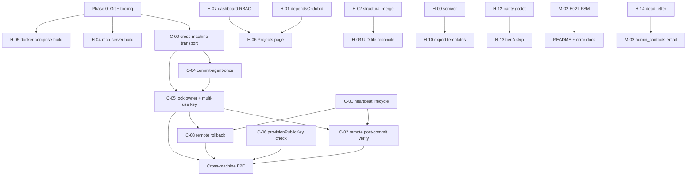

# VMCP (Vibrato PGOS) — Exhaustive Remediation Implementation Plan

**Source audit:** `report.md` (2026-07-12)  
**Project path:** `C:\Users\makem\Desktop\VMCP`  
**Plan version:** 1.1  
**Scope:** All 6 Critical, 14 High, 18 Medium, 12 Low findings + test/deployment gaps from report §8–§10

This plan is the authoritative step-by-step guide to close every identified gap. **No shortcuts.** Each finding has explicit files, ordered steps, tests, and a Definition of Done (DoD). Work proceeds in dependency order within phases; do not skip verification gates.

### Plan revision history

| Ver | Change |
|-----|--------|
| 1.0 | Initial plan from audit |
| 1.1 | **Plan hardening (pre-implementation).** Fixed ForcedCommand vs multi-step SSH/SCP contradiction; `singleUse` vs multi-invocation; invalid `DISPATCH_FAILED` status; C-05 env-prefix vs ForceCommand; heartbeat Option B (invalid on GHA); C-03 backup lifecycle; H-01 promote algorithm; wrong file paths; L-04 already fixed in tree; feature-flag defaults; H-02/H-03 topology; complete L-07; provision-time lock env as primary C-05 path |

---

## Table of Contents

1. [Prerequisites & Baseline](#1-prerequisites--baseline)
2. [Dependency Graph](#2-dependency-graph)
3. [Phase 0 — Repository & Tooling Foundation](#3-phase-0--repository--tooling-foundation)
4. [Phase P0 — Cross-Machine Production Blockers (Critical)](#4-phase-p0--cross-machine-production-blockers-critical)
5. [Phase P1 — Acceptance Criteria Completion (High)](#5-phase-p1--acceptance-criteria-completion-high)
6. [Phase P2 — Reliability & Observability (High + Medium)](#6-phase-p2--reliability--observability-high--medium)
7. [Phase P3 — Quality, Hygiene & Test Expansion (Medium + Low)](#7-phase-p3--quality-hygiene--test-expansion-medium--low)
8. [Master Verification Matrix](#8-master-verification-matrix)
9. [Rollout & Risk Controls](#9-rollout--risk-controls)
10. [Appendix A — File Touch Index](#appendix-a--file-touch-index)
11. [Appendix B — Acceptance Criteria Traceability](#appendix-b--acceptance-criteria-traceability-readme-103117)
12. [Appendix C — Plan Correctness Constraints](#appendix-c--plan-correctness-constraints-must-not-regress)

---

## 1. Prerequisites & Baseline

### 1.1 Environment requirements

| Requirement | Purpose |
|-------------|---------|
| Node.js ≥ 20 (see `.nvmrc` = `20`) | Monorepo build/test |
| Go ≥ 1.22 | `commit-agent` build & tests |
| Docker + Compose | Local integration |
| `shellcheck` | Worker script CI |
| GitHub Actions secrets (`PGOS_BASE_URL`, `PGOS_ADMIN_TOKEN`, S3, etc.) | Worker E2E |
| Self-hosted `godot-worker` runner (Tier A) | Parity & cross-machine staging |
| Target host with `commit-agent` + matching Godot binary on PATH | Cross-machine commit + remote reimport |

### 1.2 Baseline verification (run before any code changes)

Record outputs in a local scratch log (optional, not committed):

```bash
cd /path/to/VMCP   # or: cd C:\Users\makem\Desktop\VMCP
npm run typecheck
npm test
npm run build
cd packages/commit-agent && go test ./...
cd ../..
node scripts/verify-workflow-mirrors.mjs
npm run lint
```

**Gate:** All must pass as documented in `report.md` §Executive Summary. Failures block phase start.

**Known baseline facts (verify, do not assume broken):**

| Item | Current tree state (2026-07-12) |
|------|--------------------------------|
| Git | **Not initialized** (`L-11`) |
| Root `build` | Excludes `@vibrato/mcp-server` (`H-04`) |
| Root `lint` | Only `@vibrato/orchestrator` (`L-03`) |
| Orchestrator `test` script | Already `tests/**/*.test.ts src/**/*.test.ts` — **L-04 is largely closed**; re-verify discovery of all 13 files under `packages/orchestrator/tests/` |
| `JOB_STATUSES` | **No** `DISPATCH_FAILED` — must add via migration if used |
| Commit-agent unit path | `packages/commit-agent/systemd/pgos-commit-agent.service` (not `deploy/`) |
| Shared semver module | `packages/shared/src/semver-range.ts` (not `semver.ts`) |

### 1.3 Branching strategy

1. Initialize git (Phase 0, L-11).
2. Create long-lived branch `remediation/audit-2026-07-12`.
3. One PR per finding ID (or tightly coupled group, e.g. C-04+C-05 transport) stacked into the remediation branch.
4. Each PR must include: code + tests + mirror sync (if workflow touched) + doc updates.

---

## 2. Dependency Graph



**Rules:**

1. **C-00** (transport redesign) is a prerequisite for C-02–C-05; implementing wrappers without multi-verb ForcedCommand protocol will fail staging `scp`/`ssh` shell commands.
2. C-01 can proceed in parallel with C-00/C-04/C-05 but must complete before staging cross-machine jobs (E005 risk).
3. C-06 is independent of transport but required before E2E gate.
4. Phase 0 tooling (H-04/H-05/L-11) should land first so CI can gate everything else.

---

## 3. Phase 0 — Repository & Tooling Foundation

### 0.1 — L-11: Initialize Git repository

**Finding:** No `.git` directory; CI cannot trigger on push.

| Step | Action |
|------|--------|
| 0.1.1 | `git init` at repo root |
| 0.1.2 | Audit `.gitignore`: ensure `node_modules/`, `dist/`, `.env`, `*.pem`, `*.key`, `packages/commit-agent/bin/`, `packages/dashboard/dist/` covered. **Add if missing:** `secrets/`, `.godot-cache/`, `REMEDIATION_BASELINE.md` |
| 0.1.3 | Initial commit: existing codebase snapshot (no `node_modules`, no secrets) |
| 0.1.4 | Add remote; enable branch protection on `main` (require CI green) when remote exists |
| 0.1.5 | Confirm `.github/workflows/ci.yml` runs on `push` and `pull_request` |

**DoD:** `git status` clean after baseline; CI green on default branch once remote is connected.

---

### 0.2 — L-03 (+ L-04 verify): Extend lint & re-verify orchestrator tests

**Files:** `package.json`, `packages/*/package.json` (TS workspaces)

| Step | Action |
|------|--------|
| 0.2.1 | Root `lint` script: chain all five TS workspaces: `shared`, `orchestrator`, `dashboard`, `sandbox-service`, `mcp-server` |
| 0.2.2 | Each package: add `"lint": "tsc -p tsconfig.json --noEmit"` if missing (`dashboard`, `mcp-server`, `shared`, `sandbox-service` currently may lack it) |
| 0.2.3 | **L-04 verify:** Confirm `packages/orchestrator/package.json` test script includes `tests/**/*.test.ts`. Run `npm test -w @vibrato/orchestrator` and assert all **13** files under `tests/` execute. Only change the glob if discovery fails |
| 0.2.4 | Add lint step to CI if not already covering all workspaces |

**DoD:** `npm run lint` passes all 5 TS workspaces; orchestrator discovers all 13 test files.

---

### 0.3 — H-04: Add `mcp-server` to root build

**Files:** `package.json`, `.github/workflows/ci.yml`, `README.md`

| Step | Action |
|------|--------|
| 0.3.1 | Append `&& npm run build -w @vibrato/mcp-server` to root `build` script |
| 0.3.2 | Add alias: `"build:mcp": "npm run build -w @vibrato/mcp-server"` |
| 0.3.3 | Verify `packages/mcp-server/package.json` `bin.vibrato-mcp` → `./dist/index.js` |
| 0.3.4 | CI build job must assert `packages/mcp-server/dist/index.js` exists post-build |
| 0.3.5 | Update `README.md` build section so mcp-server is part of root build (not a manual-only step) |

**DoD:** Fresh `npm ci && npm run build` produces mcp-server `dist/index.js`; `node packages/mcp-server/dist/index.js` starts (stdio MCP; may exit on no TTY — at minimum file exists and loads).

---

### 0.4 — H-05: Fix docker-compose orchestrator build

**Files:** `docker-compose.yml`, `README.md`

**Current bug:** `command` runs only `npm run build -w @vibrato/shared` then `dev` orchestrator. Dashboard static assets require `packages/dashboard/dist` (see `app.ts` `resolveDashboardDist()`).

| Step | Action |
|------|--------|
| 0.4.1 | Replace orchestrator build portion with: `npm run build -w @vibrato/shared && npm run build -w @vibrato/dashboard && npm run build -w @vibrato/orchestrator` before migrate + start |
| 0.4.2 | Prefer `npm run start -w @vibrato/orchestrator` for compose “prod-like” service; keep a `dev` override profile if desired. **Do not** rely on host-prebuilt `dist/` |
| 0.4.3 | Sandbox service: `npm run build -w @vibrato/sandbox-service && npm run start -w @vibrato/sandbox-service` (or documented dev profile) |
| 0.4.4 | Comment block only for commit-agent (host install — not a full VM in compose) |
| 0.4.5 | Document fresh-clone flow: `cp .env.example .env`, `scripts/generate-jwt-keys.sh`, set keys in `.env`, `docker compose up --build` |
| 0.4.6 | Manual test: delete all package `dist/` dirs, `docker compose up --build`, confirm API health + dashboard HTML at `:8080` |

**DoD:** Fresh clone + compose serves API + dashboard UI without prior host build.

---

## 4. Phase P0 — Cross-Machine Production Blockers (Critical)

> **Objective:** Eliminate false E005 lock reclamation and make cross-machine stage → commit → verify → rollback correct end-to-end under **SSH ForcedCommand** constraints.

---

### 4.0 — C-00: Cross-machine transport design (prerequisite for C-02–C-05)

**Why this section exists (plan defect in v1.0):**

The orchestrator provisions JIT keys with:

```text
forcedCommand: "commit-agent-once"
singleUse: true
ttlSeconds: 300
```

The worker today uses the **same key** for:

1. `scp` staging tarball  
2. `ssh … "mkdir && tar && …"` shell staging  
3. `ssh … "commit …"`  

**OpenSSH ForcedCommand replaces the remote command for every session**, including `scp`/`sftp`. Prefixing env vars on the remote command string does **not** export process env when ForcedCommand runs — the client string becomes `SSH_ORIGINAL_COMMAND` only. **`singleUse: true` allows only one auth**, but the pipeline needs multiple round-trips (stage, commit, verify, optional restore).

Shipping only a `commit-agent-once` wrapper (C-04 alone) **cannot** make the current `atomic-commit.sh` path work.

#### 4.0.1 Target protocol (normative)

Expand `commit-agent` `-once` / ForcedCommand surface to a **closed verb set** (no shell). Worker never relies on remote `/bin/sh`.

| Verb | STDIN | Args | Behavior |
|------|-------|------|----------|
| `stage-receive` | tar.gz stream | `<dest_dir> <sha256>` | Create dest under `/tmp/staging-*`, extract, verify checksum; exit 0/1 |
| `commit` | none | `<token> <source_dir> <target_dir>` | Existing atomic rename + fencing (reads lock env) |
| `reimport` | none | `<project_path> <timeout_sec>` | Run headless Godot reimport; stream log to stdout; exit = godot code |
| `restore` | tar.gz stream **or** none | `<target_dir> [backup_path]` | Replace target from stdin archive or local backup path |

**Rejected approaches (do not implement as primary):**

| Approach | Why rejected |
|----------|--------------|
| Env prefix on ssh remote cmdline with ForcedCommand | Does not set process environment; only fills `SSH_ORIGINAL_COMMAND` |
| Keep `scp` + shell `mkdir/tar` with ForcedCommand key | ForceCommand breaks scp/shell |
| Heartbeat PID via `$GITHUB_ENV` across GHA steps | Background PIDs die when the step ends |
| Feature-flag remote verify default **off** | Leaves Critical C-02 bug active in production |

#### 4.0.2 JIT key lifetime

**Files:** `packages/orchestrator/src/services/ssh-provision.ts`, target provision API contract (document in `packages/commit-agent/README.md` + `workers/README.md`)

| Step | Action |
|------|--------|
| 4.0.2.1 | Change provision payload from `singleUse: true` → **`singleUse: false`** with `ttlSeconds: 300` and optional `maxSessions: 8` (stage + commit + verify + retries + restore) |
| 4.0.2.2 | Document that the **target provision endpoint** must honor multi-session within TTL and purge key after TTL or explicit revoke |
| 4.0.2.3 | Embed per-job fencing identity in `authorized_keys` `environment=` (see C-05) so AcceptEnv is not required |

#### 4.0.3 Shared SSH helper

**Files:** `workers/scripts/lib/pgos-remote.sh` (new)

| Function | Responsibility |
|----------|----------------|
| `pgos_ssh_opts` | Shared `-o` flags + identity file |
| `pgos_ssh_agent <verb and args>` | `ssh … "$TARGET_HOST" "<verb> …"` with ForcedCommand-safe original command |
| `pgos_ssh_agent_stdin <verb and args>` | Pipe stdin to remote verb (stage/restore) |
| `pgos_cleanup_ssh_key` | shred/remove key file + known_hosts (H-11) |

**DoD (C-00):** Design documented in commit-agent + workers READMEs; subsequent C-02–C-05 PRs implement against this protocol only.

---

### 4.1 — C-04: Ship `commit-agent-once` + multi-verb `-once` handler

**Files:**

- `packages/commit-agent/bin/commit-agent-once` (new)
- `packages/commit-agent/cmd/agent/main.go` (verb dispatch)
- `packages/commit-agent/cmd/agent/main_test.go`
- `packages/commit-agent/systemd/pgos-commit-agent.service` (docs/comments only if needed)
- `packages/commit-agent/README.md`
- `workers/README.md`

| Step | Action |
|------|--------|
| 4.1.1 | Create executable wrapper: |
| | `#!/usr/bin/env bash` |
| | `set -euo pipefail` |
| | `exec /usr/local/bin/commit-agent -once "${SSH_ORIGINAL_COMMAND:-$*}"` |
| 4.1.2 | Install target: document `install` steps copying binary + wrapper to `/usr/local/bin/` (Makefile optional) |
| 4.1.3 | Implement verb parser in `handleArgs`: `stage-receive`, `commit`, `reimport`, `restore` (reject unknown) |
| 4.1.4 | `stage-receive`: read stdin, enforce dest under allowed staging root (`/tmp`), verify sha256, no path escape |
| 4.1.5 | `reimport`: `exec` fixed godot path from env `GODOT_BIN` default `godot`; args only `--headless --editor --quit --path <validated>`; timeout via context |
| 4.1.6 | `restore`: validate paths; replace target from stdin tar or backup path; refuse path traversal |
| 4.1.7 | Document `authorized_keys` line: `command="commit-agent-once",no-port-forwarding,no-X11-forwarding,no-agent-forwarding,no-pty …` |
| 4.1.8 | Tests: each verb happy path + path traversal reject; `-once` with `SSH_ORIGINAL_COMMAND` |

**DoD:** ForcedCommand entrypoint exists; multi-verb surface tested; no remote shell required for stage/commit/verify/restore.

---

### 4.2 — C-05: Propagate per-job lock owner (and key) to remote agent

**Root cause:** Worker exports `PGOS_LOCK_*` locally; remote agent reads host/static env. Fencing requires `owner === job:{jobId}`.

**Files:**

- `packages/orchestrator/src/services/ssh-provision.ts`
- `packages/orchestrator/src/services/job-service.ts` (pass lockKey/owner into provision)
- `workers/scripts/atomic-commit.sh`
- `workers/scripts/lib/pgos-remote.sh`
- `packages/commit-agent/cmd/agent/main.go`
- `packages/commit-agent/README.md`

#### Approach A — **Recommended (primary): provision-time `environment=`**

Works with ForcedCommand without `AcceptEnv` (hardened sshd often disables AcceptEnv).

| Step | Action |
|------|--------|
| 4.2.1 | Extend `provisionPublicKey` body with `environment: { PGOS_LOCK_KEY, PGOS_LOCK_OWNER, PGOS_JOB_ID, PGOS_REQUIRE_FENCING: "true" }` (and document that the **target provisioner** writes OpenSSH `environment="KEY=val,KEY2=val2"` on the key line) |
| 4.2.2 | From `dispatchJob`, pass `lockKey` + `lockOwner: job:{jobId}` into provision call |
| 4.2.3 | Worker `atomic-commit` cross-machine path: **stop** relying on remote shell env prefix; use `pgos_ssh_agent` verbs only |
| 4.2.4 | Agent continues to read `PGOS_LOCK_KEY` / `PGOS_LOCK_OWNER` from process env (populated by sshd from `environment=`) |
| 4.2.5 | Go test: set env, assert `validateToken` called with `job:{uuid}` owner |

#### Approach B — Fallback when provisioner cannot set `environment=`

| Step | Action |
|------|--------|
| 4.2.6b | Extend `commit` verb: `commit <token> <source> <target> <lockKey> <lockOwner> <nonce>` **or** one-line JSON on stdin after verb |
| 4.2.7b | Prefer args only if length limits OK; otherwise JSON line protocol |
| 4.2.8b | Still require `PGOS_REQUIRE_FENCING=true` default in systemd unit for socket mode |

**Do not implement as primary:** `ssh host "PGOS_LOCK_OWNER=… commit …"` under ForcedCommand (does not export env).

**DoD:** Cross-machine commit with fencing succeeds when orchestrator owner is `job:{jobId}`; wrong owner → fencing reject (E013/E004 path). Staging works without remote shell.

---

### 4.3 — C-06: Check `provisionPublicKey()` before dispatch

**Files:**

- `packages/orchestrator/src/services/job-service.ts` (~L289–305)
- `packages/shared/src/job-status.ts`
- `packages/orchestrator/src/db/migrations/003_dispatch_failed.sql` (new)
- `packages/orchestrator/tests/job-lifecycle.test.ts` (or new cases in existing file — **not** a non-existent `job-service.test.ts`)
- `packages/shared/src/job-status.test.ts` (FSM coverage)

**Status decision (normative):** There is **no** `DISPATCH_FAILED` today (DB check + `JOB_STATUSES`). Implement it properly:

| Step | Action |
|------|--------|
| 4.3.1 | Add `DISPATCH_FAILED` to `JOB_STATUSES`, `RETRIABLE_FAILURE_STATUSES`, and `JOB_STATUS_TRANSITIONS`: |
| | - `QUEUED` → `DISPATCH_FAILED` (direct write before DISPATCHING) |
| | - `DISPATCHING` → `DISPATCH_FAILED` (optional consistency) |
| | - `DISPATCH_FAILED` → `QUEUED` \| `DEAD_LETTER` \| `CANCELLED` \| `LOCK_STALE` |
| | Also add `DISPATCH_FAILED` to `createJob` `activeStatuses` (same slot as `DISPATCH_TIMEOUT` / `COMMIT_FAILED`) so mid-retry jobs still serialize generation |
| | Retry worker / `updateStatus` paths that requeue `DISPATCH_TIMEOUT` must treat `DISPATCH_FAILED` identically |
| 4.3.2 | Migration `003_dispatch_failed.sql`: drop/recreate `jobs_status_check` including `DISPATCH_FAILED` |
| 4.3.3 | Capture return: `const provision = await provisionPublicKey({…})` |
| 4.3.4 | If `!provision.ok`: |
| | a. `release` generation lock + target-path lock if acquired |
| | b. Set job `DISPATCH_FAILED` with `errorCode: 'E004'` (commit/dispatch infrastructure) **or** keep E004 and detail `ssh provision failed: …` — do **not** invent E021 here |
| | c. `recordError` with `provision.detail` |
| | d. **Do not** put `sshPrivateKey` in JWE; **do not** call `dispatchWorkflow` |
| | e. Audit already records `ssh.jit_provisioned` with status — ensure failure path still audits |
| 4.3.5 | If `commitStrategy === 'cross-machine'`: require **both** `metadata.targetHost` and `metadata.targetProvisionUrl`; else fail with `DISPATCH_FAILED` + clear detail (today host-without-URL silently skips provision and still dispatches — fix that) |
| 4.3.6 | Tests: mock `provisionPublicKey` → `{ ok: false }` → locks released, no workflow dispatch, no SSH in envelope metadata; success path unchanged |

**DoD:** Dispatch never proceeds with SSH key in envelope when provisioning fails; DB accepts `DISPATCH_FAILED`.

---

### 4.4 — C-01: Extend heartbeat through commit + post-commit phases

**Root cause:** Heartbeat runs only in “Stage, reimport, validate” step; killed before `atomic-commit.sh` (≤5 min lock wait) and `post-commit-verify.sh` (≤300s × retries).

**Files:**

- `.github/workflows/godot_worker.yml`
- `workers/.github/workflows/godot_worker.yml` (mirror)
- `workers/scripts/lib/pgos-lifecycle.sh` (new)
- `workers/scripts/heartbeat.sh`
- `scripts/verify-workflow-mirrors.mjs` (run after)

| Step | Action |
|------|--------|
| 4.4.1 | Create `pgos-lifecycle.sh`: `pgos_start_heartbeat`, `pgos_stop_heartbeat`, `pgos_heartbeat_trap` (EXIT/INT/TERM) |
| 4.4.2 | **Only viable GHA approach — single long step (or one step that owns the PID for its entire lifetime):** After resolve-secrets, cache, setup-godot, and version verify, use **one** step “Execute job pipeline”: |
| | ```bash |
| | source workers/scripts/lib/pgos-lifecycle.sh |
| | pgos_heartbeat_trap |
| | pgos_start_heartbeat |
| | bash workers/scripts/run-generation.sh |
| | bash workers/scripts/atomic-commit.sh |
| | bash workers/scripts/post-commit-verify.sh |
| | ``` |
| 4.4.3 | Keep earlier steps (checkout, resolve-secrets, cache, setup-godot, E006 verify, optional STAGING PATCH) **before** the long step; start heartbeat at the beginning of the long step **before** generation (covers generation + commit + verify) |
| 4.4.4 | **Do not** use “persist heartbeat PID via `$GITHUB_ENV` across steps” — child processes are reaped when the step ends |
| 4.4.5 | Default interval 15s; document orchestrator `HEARTBEAT_STALE_AFTER_MS=30000` |
| 4.4.6 | `node scripts/verify-workflow-mirrors.mjs` |
| 4.4.7 | Shell test or CI job: mock PATCH endpoint, assert ≥3 heartbeats over 45s while a sleep simulates commit |

**DoD:** Heartbeat continues for a simulated 120s commit+verify window; no false E005 in staging with C-01 deployed.

---

### 4.5 — C-02: Remote post-commit verification (cross-machine)

**Files:**

- `workers/scripts/post-commit-verify.sh`
- `workers/scripts/lib/pgos-remote.sh`
- `packages/commit-agent` (`reimport` verb — C-04)

| Step | Action |
|------|--------|
| 4.5.1 | Branch on `COMMIT_STRATEGY`: |
| | `same-machine` → existing local `godot --path "$TARGET_ROOT"` |
| | `cross-machine` → `pgos_ssh_agent reimport "${TARGET_ROOT}" "${timeout}"` (capture remote log from stdout to `/tmp/post_reimport_${JOB_ID}.log`) |
| 4.5.2 | Grep UID/load errors on the **captured** log; only PATCH `COMPLETED` on success |
| 4.5.3 | Document: target host Godot version must match job `GODOT_VERSION` / `GODOT_BIN` |
| 4.5.4 | **Default-on** for cross-machine (no kill-switch that leaves local-godot-on-runner as default). Optional `PGOS_REMOTE_VERIFY=0` only for emergency break-glass, documented as unsafe |
| 4.5.5 | Fixture test: mock `ssh` / `pgos_ssh_agent` asserting remote reimport verb used when `COMMIT_STRATEGY=cross-machine` |

**DoD:** Cross-machine jobs verify Godot on `TARGET_HOST` filesystem; same-machine path unchanged.

---

### 4.6 — C-03: Remote rollback on cross-machine post-commit failure

**Files:**

- `workers/scripts/post-commit-verify.sh`
- `workers/scripts/lib/pgos-remote.sh`
- `packages/commit-agent` (`restore` verb + backup retention)

**Backup lifecycle (normative — fixes v1.0 hole):**

Current agent renames target → `*.pgos-bak-<nano>` then **deletes backup on success**. Post-commit verify needs a restore source **after** successful commit:

1. **Primary:** S3 pre-commit snapshot (`PRESIGN_SNAPSHOT_GET`) — already uploaded in `atomic-commit.sh`  
2. **Secondary:** Retain agent backup until explicit discard OR rely solely on S3 for remote  

| Step | Action |
|------|--------|
| 4.6.1 | On rollback branch (`attempt >= max`) and `COMMIT_STRATEGY=cross-machine`: |
| | a. Download S3 snapshot to runner archive (existing `pgos_download`) |
| | b. `pgos_ssh_agent_stdin restore "${TARGET_ROOT}" < snapshot.tar.gz` |
| | c. If S3 fails and backup path known: `pgos_ssh_agent restore "${TARGET_ROOT}" "${BACKUP_PATH}"` |
| 4.6.2 | Align backup naming: either keep agent `*.pgos-bak-*` and return path in commit stdout for worker to record, **or** use `target.bak-${JOB_ID}` and **do not delete** until a new `commit-discard-backup` verb / TTL sweeper — document choice in PR. **Recommended:** S3 primary + retain `target.bak-${JOB_ID}` until next successful commit for that path |
| 4.6.3 | PATCH `ROLLBACK` + `E002` only after remote restore attempt completes (success or hard-fail detail in `errorDetail`) |
| 4.6.4 | Integration test: force reimport failure; assert remote tree checksum matches snapshot |

**DoD:** Failed cross-machine post-commit restores **target host** tree; runner-local `TARGET_ROOT` never used as restore destination for remote jobs.

---

### 4.7 — Rewrite `atomic-commit.sh` cross-machine path (implements C-00/C-04/C-05/H-11)

**Files:** `workers/scripts/atomic-commit.sh`, `workers/scripts/lib/pgos-remote.sh`, `workers/scripts/lib/pgos-lifecycle.sh`

| Step | Action |
|------|--------|
| 4.7.1 | Cross-machine: build tarball locally; `SUM=$(sha256sum …)` |
| 4.7.2 | `pgos_ssh_agent_stdin stage-receive "${REMOTE_TMP}" "${SUM}" < tarball` |
| 4.7.3 | `pgos_ssh_agent commit "${FENCING_TOKEN}" "${REMOTE_TMP}" "${TARGET_ROOT}"` |
| 4.7.4 | Register `pgos_cleanup_ssh_key` on EXIT (H-11): `shred -u` or overwrite + `rm` `/tmp/pgos-ssh-key-${JOB_ID}`; remove `/tmp/pgos_known_hosts` if created for this job |
| 4.7.5 | Same-machine path unchanged (local mv + `.bak-${JOB_ID}`) |
| 4.7.6 | Note: `wait_for_editor_lock` currently checks **runner-local** `TARGET_ROOT` — for cross-machine, either skip local lock wait or add `pgos_ssh_agent` lock probe; **must not** wait on wrong filesystem. Implement: if cross-machine, skip local `project.godot.lock` wait **or** remote-stat the lock file via a small `stat-lock` verb if editor lock on target matters |

**DoD:** Cross-machine commit uses only ForcedCommand verbs; SSH key removed after script exit; no false local lock wait.

---

### 4.8 — P0 Integration gate: Cross-machine E2E

**Prerequisites:** C-00 through C-06 and C-01 complete.

| Step | Action |
|------|--------|
| 4.8.1 | Manual E2E checklist in `workers/README.md` |
| 4.8.2 | Staging: real `targetHost` + `targetProvisionUrl` multi-session provisioner |
| 4.8.3 | Happy path: provision → dispatch → generate → stage-receive → commit → reimport → COMPLETED |
| 4.8.4 | Failure: break provision → `DISPATCH_FAILED`, no workflow (or no secret SSH material) |
| 4.8.5 | Failure: force reimport fail → remote restore + ROLLBACK |
| 4.8.6 | Failure: kill heartbeat process → E005 only after stale window; healthy heartbeat survives long commit |

**DoD:** Signed E2E run log attached to remediation PR; all P0 items closed.

---

## 5. Phase P1 — Acceptance Criteria Completion (High)

---

### 5.1 — H-01: Enforce `dependsOnJobId` at create and dispatch

**Files:**

- `packages/orchestrator/src/services/job-service.ts`
- `packages/orchestrator/tests/job-lifecycle.test.ts` (expand; file name as in tree)
- `README.md` acceptance row if needed

**Semantics (normative):**

| Field | Meaning |
|-------|---------|
| `depends_on_job_id` | Ordering dependency — must be `COMPLETED` before dispatch |
| `blocked_by_job_id` | Concurrency gate — another active job holds generation slot |

| Step | Action |
|------|--------|
| 5.1.1 | In `createJob`, when `req.dependsOnJobId` set: |
| | a. Load dependency; 404/400 if missing or `project_id` mismatch |
| | b. If dependency status ≠ `COMPLETED`: insert with `status='BLOCKED'`, keep `depends_on_job_id`; set `blocked_by_job_id` to concurrent active job if any, else **null** (dependency-only block) |
| | c. Do **not** call `dispatchJob` until unblocked |
| 5.1.2 | In `dispatchJob` **first guard:** if `dependsOnJobId` set, load dependency; if not `COMPLETED`, force `BLOCKED` and return (never acquire locks) |
| 5.1.3 | Fix `promoteBlockedJobs` algorithm: |
| | ``` |
| | for each BLOCKED job in project (created_at ASC): |
| |   if dependsOnJobId: |
| |     load dep |
| |     if dep is terminal non-COMPLETED → DEP_FAILED + E011; continue |
| |     if dep status ≠ COMPLETED → skip (still waiting) |
| |   if blockedByJobId and blockedByJobId ≠ finishedJobId: |
| |     # still waiting on a different concurrency blocker |
| |     skip unless blockedByJobId's job is also terminal |
| |   if concurrency still held by another active job → skip |
| |   else → QUEUED + dispatchJob; break (one promote per call) |
| | ``` |
| 5.1.4 | When finished job is the dependency and non-COMPLETED terminal → dependents with that `dependsOnJobId` → `DEP_FAILED` + E011 |
| 5.1.5 | Tests: A→B block until A completes; B fails if A fails; concurrent active job still blocks; B not promoted when concurrency clears but dependency incomplete |

**DoD:** Dependent jobs cannot dispatch until dependency COMPLETED; promote logic handles both gates.

---

### 5.2 — H-02: Implement structural merge for `.tscn` files

**Current:** `merge-service.ts` only INSERTs `overrides`.

**Topology constraint:** `project_root` in DB may point at a path **only on the generation target**, not on the orchestrator filesystem. Plan must not assume Railway disk has Godot projects.

**Files:**

- `packages/orchestrator/src/services/merge-service.ts`
- `packages/orchestrator/src/services/tscn-merge.ts` (new)
- `packages/orchestrator/tests/merge-service.test.ts` (expand existing)
- `AGENTS.md`, `README.md`

| Step | Action |
|------|--------|
| 5.2.1 | Module API: `parseTscn` / `mergeTscn` / `serializeTscn` |
| 5.2.2 | Node match by stable path / name within parent (AGENTS.md) |
| 5.2.3 | Property merge; sub-resources by `uid://` when present |
| 5.2.4 | Preserve `patchIntroducesScript` → admin / E019 |
| 5.2.5 | `applyMerge` modes (select via env `PGOS_MERGE_MODE` or project metadata): |
| | **A. Local FS (default when `project_root` exists and is readable):** `assertWithinBase` + read/write atomic temp+rename + INSERT override with content hash |
| | **B. Registry-only + outbox (when path not local):** INSERT override + `merge_outbox` row for worker/target apply — **must document**; do not claim file write if skipped |
| 5.2.6 | Prefer implementing **A** fully with golden fixtures; if production is cross-machine-only, implement **B** apply hook in worker or commit-agent in same PR series — do not ship half-claim |
| 5.2.7 | Feature flag `PGOS_STRUCTURAL_MERGE=1` defaults **on in staging tests**; production default **on** once E2E passes (flag only for emergency rollback) |
| 5.2.8 | Tests: golden base+patch→expected; script patch requires admin; path traversal E014 |

**DoD:** Documented mode matches behavior; threat model tests pass; AGENTS.md accurate.

---

### 5.3 — H-03: UID nightly reconcile with file scan + Godot rewrite

**Current:** `autoResolveDuplicates` updates DB only.

**Files:**

- `packages/orchestrator/src/services/uid-service.ts`
- `packages/orchestrator/src/services/uid-file-reconcile.ts` (new)
- `packages/orchestrator/src/workers/health-worker.ts`
- `workers/scripts/uid-reconcile.sh` (new) for host-side Godot
- `AGENTS.md`

| Step | Action |
|------|--------|
| 5.3.1 | `scanProjectForUids(projectRoot) → Map<uid, paths[]>` over `.tscn`, `.tres`, `.import` text |
| 5.3.2 | Correlate with `uid_mappings`; detect drift |
| 5.3.3 | After DB reassignment, replacement map `oldUid → newUid` |
| 5.3.4 | File rewrite with bounded regex (`uid://OLD` full token only) |
| 5.3.5 | Godot validation: headless reimport when Godot available on orchestrator host; else enqueue `uid-reconcile` worker workflow/SSH to project host |
| 5.3.6 | On failure → E008 manual queue; no silent partial commit without audit |
| 5.3.7 | Audit `uid.nightly_reconcile` with `{fixed, manual, filesTouched}` |
| 5.3.8 | Tests: fixture project with duplicate UIDs in two files |

**DoD:** Nightly path updates files + DB for local topology; remote topology documented and scripted.

---

### 5.4 — H-06: Dashboard Projects page + job enqueue unblock

**Files:**

- `packages/dashboard/src/pages/ProjectsPage.tsx` (new)
- `packages/dashboard/src/App.tsx`
- `packages/dashboard/src/api/client.ts`
- `packages/dashboard/src/pages/JobsPage.tsx`
- `packages/orchestrator/src/routes/projects.ts` (verify POST)

| Step | Action |
|------|--------|
| 5.4.1 | `createProject` → `POST /projects` |
| 5.4.2 | Projects page: list + create form (admin); high-volume toggle if API supports |
| 5.4.3 | Nav `/projects` — admin create; operator/viewer read-only list as API allows |
| 5.4.4 | Jobs page: project dropdown from `api.projects()`; enable Enqueue when ≥1 project |
| 5.4.5 | Extend `createJob` client (L-10): `godotVersion`, `preferredTier`, `commitStrategy`, `dependsOnJobId`, `metadata` |
| 5.4.6 | Advanced enqueue fields for version/tier/strategy |
| 5.4.7 | Tests: render + createProject called for admin |

**DoD:** Admin can create project in UI; operator can enqueue without empty-DB dead-end.

---

### 5.5 — H-07: Dashboard RBAC — nav gating + 403 handling

**Files:**

- `packages/dashboard/src/App.tsx`
- `packages/dashboard/src/pages/ExtensionsPage.tsx`
- `packages/dashboard/src/pages/DeadLetterPage.tsx`
- `packages/dashboard/src/api/client.ts`
- Restricted pages as needed

| Step | Action |
|------|--------|
| 5.5.1 | `canAccess(role, route)`: Extensions → admin; Dead letter → operator+admin; align with API (`extensions` admin, `dead-letter` operator+) |
| 5.5.2 | Conditionally render nav links |
| 5.5.3 | Route guards: permission panel, not raw crash |
| 5.5.4 | Client `request()`: surface `body.error.code` (E013/E019/E015/…) |
| 5.5.5 | Pages: try/catch + banner on 403 |
| 5.5.6 | Tests: viewer hides Extensions; Extensions page permission message |

**DoD:** Nav matches API policy; no surprise 403-only empty pages.

---

### 5.6 — H-08: Firecracker launcher — implement or production-gate

**Files:**

- `packages/sandbox-service/scripts/firecracker-launcher.sh`
- `packages/sandbox-service/src/production-validation.ts`
- `packages/sandbox-service/src/index.ts` (health)
- `packages/sandbox-service/tests/health.test.ts`

| Step | Action |
|------|--------|
| 5.6.1 | `FIRECRACKER_LAUNCHER_MODE=stub\|real` (dev default `stub`) |
| 5.6.2 | Production validation **fails** if `FIRECRACKER_SOCKET` set and mode is `stub`, **or** if production requires Firecracker and launcher is stub |
| 5.6.3 | Health: `firecrackerReady: true` only when real mode + socket responsive; stub reports `backend: firecracker-stub` / ready false in prod-shaped configs |
| 5.6.4 | Real path: document ops requirements; implement spawn from stdin JSON **or** explicitly defer real hypervisor with fail-closed gate (acceptable if gate is airtight) |
| 5.6.5 | Tests: production validation rejects stub misconfig; dev accepts stub |

**DoD:** Production cannot advertise healthy Firecracker on stub launcher.

---

## 6. Phase P2 — Reliability & Observability (High + Medium)

---

### 6.1 — H-09 + H-10: Exact Godot semver + export template validation (E006)

**Files:**

- `.github/workflows/godot_worker.yml` (+ mirror)
- `workers/scripts/setup-godot.sh`
- `workers/scripts/verify-godot.sh` (new)
- `packages/shared/src/semver-range.ts` (reuse `parse`/compare ideas; add `versionsEqual` if needed — **path is `semver-range.ts`**)

| Step | Action |
|------|--------|
| 6.1.1 | `verify-godot.sh` accepts `GODOT_VERSION` |
| 6.1.2 | Parse `godot --version` first line; **exact** semver equality (not `grep -F`) so `4.3.1` ∉ match `4.3.10` |
| 6.1.3 | Validate export templates under Godot user path or `.godot-cache` for that version |
| 6.1.4 | On failure: PATCH `VALIDATION_FAILED` + `E006` with detail (version vs templates) |
| 6.1.5 | Replace workflow inline grep with `bash workers/scripts/verify-godot.sh` |
| 6.1.6 | Test: request `4.3.1`, installed string `4.3.10` → fail |

**DoD:** E006 catches substring false positives and missing templates pre-generation.

---

### 6.2 — H-11: Ephemeral SSH key cleanup

Covered primarily in §4.7.4; verify standalone:

| Step | Action |
|------|--------|
| 6.2.1 | EXIT/ERR/INT trap always registered when key file created |
| 6.2.2 | Never log PEM contents |
| 6.2.3 | DoD: `/tmp/pgos-ssh-key-*` absent after success or failure |

---

### 6.3 — H-12 + H-13: Parity canary hardening

**Files:**

- `workers/scripts/parity-canary.sh`
- `.github/workflows/parity_canary.yml` (+ mirror)
- Orchestrator parity admin route / handler

| Step | Action |
|------|--------|
| 6.3.1 | Remove `|| true` from Godot reimport; propagate exit code |
| 6.3.2 | Write `reimport_status.txt` (0/1) |
| 6.3.3 | Tier A missing → POST parity `skipped: true, reason: tier_a_unavailable` — **exit 0** (no false E010) |
| 6.3.4 | Orchestrator accepts skip without E010 alert |
| 6.3.5 | Reimport failed → parity fail with distinct reason |
| 6.3.6 | **L-07:** replace `date +%s%3N` with portable `node -e "console.log(Date.now())"` in parity + perf scripts |
| 6.3.7 | Sync mirrors |

**DoD:** Tier A down → skip; Godot failure → loud fail; portable timestamps.

---

### 6.4 — H-14 + M-03: Dead-letter consumer + `admin_contacts` email

**Files:**

- `packages/orchestrator/src/workers/health-worker.ts`
- `packages/orchestrator/src/services/alert-service.ts`

| Step | Action |
|------|--------|
| 6.4.1 | Dead-letter worker: load job + `admin_contacts`; enrich; `sendAlert` to each contact |
| 6.4.2 | `sendAlert` accepts `string | string[]` |
| 6.4.3 | `escalateDeadLetters`: 24h warning / 72h critical includes contacts |
| 6.4.4 | `ADMIN_EMAIL` remains fallback CC |
| 6.4.5 | Tests: mock transport; contacts receive mail |

**DoD:** Consumer enriches + emails; hourly escalation hits project contacts.

---

### 6.5 — M-01: Fix README API docs — PATCH status role

**Files:** `README.md`

| Step | Action |
|------|--------|
| 6.5.1 | `PATCH /jobs/:id/status` → **callback only** (`requireExactRole('callback')`) |
| 6.5.2 | Document operator changes via admin/operator endpoints where they exist |

**DoD:** README matches `routes/jobs.ts`.

---

### 6.6 — M-02: Stop misusing E019 for invalid FSM transitions

**Files:**

- `packages/orchestrator/src/services/job-service.ts` (~L393–396)
- `packages/shared/src/errors.ts`
- `docs/errors/E021.md` (new)
- `packages/orchestrator/src/docs/errors/` copy via existing asset pipeline if used
- `packages/orchestrator/tests/job-status-fsm.test.ts` / job-lifecycle tests
- Dashboard error catalog fetch path

| Step | Action |
|------|--------|
| 6.6.1 | Add `E021` `INVALID_STATUS_TRANSITION` to catalog |
| 6.6.2 | Invalid transition branch returns E021 (409) |
| 6.6.3 | E019 **only** for script override admin gate |
| 6.6.4 | Doc page + ensure docs route serves it |
| 6.6.5 | Tests: transition → E021; script override → E019 |

**DoD:** Catalog semantics consistent; deep links work.

---

### 6.7 — M-04: Tier B health probe — real runner probe

**Files:** `health-worker.ts`, `github-service.ts`

| Step | Action |
|------|--------|
| 6.7.1 | Replace synthetic Redis+Postgres-only probe with GitHub API runner online check and/or scheduled `godot_health.yml` ingestion |
| 6.7.2 | Metrics: `tier_b_runner_online`, `godot_cache_warm` when available |
| 6.7.3 | Expose on `GET /tiers` |

**DoD:** Tier B reflects runner availability, not only DB latency.

---

### 6.8 — M-05 + M-06: Heartbeat and status PATCH hardening

**Files:**

- `workers/scripts/heartbeat.sh`
- `workers/scripts/lib/pgos-callback.sh` (new)
- `run-generation.sh`, `atomic-commit.sh`, `post-commit-verify.sh`

| Step | Action |
|------|--------|
| 6.8.1 | `pgos_callback_patch`: curl fail on HTTP error; retry 3× backoff on 5xx; 401/403 → exit 1 |
| 6.8.2 | Heartbeat: remove blanket `|| true`; exit after N consecutive failures |
| 6.8.3 | Replace raw lifecycle curls with helper |
| 6.8.4 | Test: mock 403 → non-zero exit |

**DoD:** Silent auth failures eliminated.

---

### 6.9 — M-07: Mask `CALLBACK_TOKEN` in GitHub Actions

**Files:** `workers/scripts/resolve-secrets.sh`, workflow if needed

| Step | Action |
|------|--------|
| 6.9.1 | `echo "::add-mask::${CALLBACK_TOKEN}"` before any env write |
| 6.9.2 | Prefer `$RUNNER_TEMP` file with mode 600 for token if feasible |
| 6.9.3 | L-12: error path logs HTTP status only, not body |
| 6.9.4 | Document in workers README |

**DoD:** Token masked; resolve failures do not print secrets.

---

### 6.10 — M-08 + M-09: Railway deployment completeness

**Files:** `railway.toml`, `README.md`, sandbox deploy doc

| Step | Action |
|------|--------|
| 6.10.1 | Document multi-service Railway: orchestrator + sandbox-service |
| 6.10.2 | Wire `SANDBOX_SERVICE_URL` |
| 6.10.3 | `healthcheckPath = "/ready"` (not `/health`) |
| 6.10.4 | Verify `/ready` → 503 when Redis/Postgres down |
| 6.10.5 | Deploy checklist in README |

**DoD:** Deploy docs cover both services; healthcheck uses readiness.

---

### 6.11 — M-10: Complete `workers/README.md`

Document every script/workflow:

| Script / Workflow | Section |
|-------------------|---------|
| `heartbeat.sh` | Interval, stale threshold, lifecycle step ownership |
| `setup-godot.sh` / `verify-godot.sh` | Cache, E006 |
| `parity-canary.sh` | Skip rules, reimport fail loud |
| `perf-profile.sh` / `mad-analyze.mjs` | Metrics |
| `godot_health.yml` | Cron `*/30` (~30 min) — fix L-08 comment |
| `parity_canary.yml` / `nightly_perf.yml` | Behavior |
| Cross-machine | C-00 verbs, provision multi-session, `commit-agent-once`, `environment=` |
| `uid-reconcile.sh` | Host rewrite |

**DoD:** New operator can run workflows from README alone.

---

### 6.12 — M-17: Write FAILOVER reason to `lock_fencing_seq`

**Files:** `packages/orchestrator/src/services/lock-service.ts`

**Current gap:** `rotateInstanceIdOnFailover` updates Redis + `redis_instance_state` and audits, but **does not INSERT** `lock_fencing_seq` with `reason='FAILOVER'`.

| Step | Action |
|------|--------|
| 6.12.1 | On rotation, INSERT ledger row(s) per design: either global sentinel lock key or bump policy documented in AGENTS — **must be visible to `validateFencingToken` invalidation rules** |
| 6.12.2 | Test: after rotation, ledger contains FAILOVER reason; old tokens fail validation |

**DoD:** Audit trail + validation behavior match acceptance criteria.

---

### 6.13 — M-18: GitHub mock dispatch failure simulation

**Files:** `packages/orchestrator/src/services/github-service.ts`, env schema

| Step | Action |
|------|--------|
| 6.13.1 | `GITHUB_MOCK=true` + `GITHUB_MOCK_DISPATCH_FAIL=true` → `dispatchWorkflow` returns failure / throws mapped error |
| 6.13.2 | Mock `getRunStatus` can return `conclusion: 'failure'` when configured |
| 6.13.3 | Test: dispatch failure → job `DISPATCH_FAILED` or existing failure handling path (align with job-service error handling — implement explicitly) |

**DoD:** Local E2E can simulate GitHub dispatch failure.

---

## 7. Phase P3 — Quality, Hygiene & Test Expansion (Medium + Low)

---

### 7.1 — M-11: Wire or remove `validate_node_paths.gd`

| Step | Action |
|------|--------|
| 7.1.1 | **Preferred:** invoke from `run-generation.sh` after staging with headless godot `--script` |
| 7.1.2 | On failure: `VALIDATION_FAILED` + E003 (or documented code) |
| 7.1.3 | **Alternative:** delete script; document Python UID validation as sole path |
| 7.1.4 | Update workers README |

**DoD:** No orphaned scripts without docs.

---

### 7.2 — M-12: Real memory measurement in `perf-profile.sh`

| Step | Action |
|------|--------|
| 7.2.1 | Replace hardcoded `64` with `/usr/bin/time -v` or peak RSS sampling |
| 7.2.2 | L-07 portable timestamp (shared with parity) |
| 7.2.3 | Upload `mem_mib.txt` artifact |

**DoD:** Nightly perf reports measured memory.

---

### 7.3 — M-13: Error catalog completeness test

**Files:** `packages/shared/src/errors.test.ts` (new)

| Step | Action |
|------|--------|
| 7.3.1 | Every `ERROR_CATALOG` key has `docs/errors/{code}.md` |
| 7.3.2 | Every doc maps back to catalog |
| 7.3.3 | Codes contiguous E001–E021 after E021 lands |

**DoD:** CI fails on catalog/docs drift.

---

### 7.4 — M-14: Expand MCP server tests

| Step | Action |
|------|--------|
| 7.4.1 | Tool registration: 6 tools |
| 7.4.2 | `pgosFetch` 401/404/500 |
| 7.4.3 | `create_job` input schema shape |
| 7.4.4 | Mock `fetch` |

**DoD:** ≥10 MCP tests.

---

### 7.5 — M-15: Sandbox production validation + execute tests

| Step | Action |
|------|--------|
| 7.5.1 | `validateSandboxProductionEnv` matrix |
| 7.5.2 | `/v1/execute` timeout kill |
| 7.5.3 | Network deny path |
| 7.5.4 | Memory limit path |

**DoD:** Execute + production gate covered.

---

### 7.6 — M-16: Commit-agent integration tests

| Step | Action |
|------|--------|
| 7.6.1 | HTTP mock fencing validation |
| 7.6.2 | `doCommit` idempotency |
| 7.6.3 | Replay rejection |
| 7.6.4 | Path traversal |
| 7.6.5 | `-once` + multi-verb + `SSH_ORIGINAL_COMMAND` |

**DoD:** `go test ./...` covers commit paths beyond sidecar JSON.

---

### 7.7 — Low-severity fixes (L-01–L-12)

| ID | File(s) | Fix |
|----|---------|-----|
| L-01 | `routes/jobs.ts` | Heartbeat rejection → `{ error: { code: 'E013', message } }` |
| L-02 | `routes/secrets.ts` | 404 structured error (`E007` only if semantically correct; else dedicated not-found payload — **do not mislabel**) |
| L-03 | Root `package.json` | Phase 0.2 |
| L-04 | Orchestrator tests | Phase 0.2 verify |
| L-05 | `config/env.ts` | Wire `REIMPORT_*` / `ORCHESTRATOR_CACHE_DIR` to docs **or** remove unused |
| L-06 | `secret-service.ts` | Remove dead `resolve()` or `@deprecated` with zero callers check |
| L-07 | `parity-canary.sh`, `perf-profile.sh` | Portable timestamps (Phase 6.3 / 7.2) |
| L-08 | `godot_health.yml` | Comment matches `*/30` (~30 min) |
| L-09 | Dashboard pages | Optional: WebSocket on Overview (P3) |
| L-10 | `api/client.ts` | Covered in H-06 |
| L-11 | Repo root | Phase 0.1 |
| L-12 | `resolve-secrets.sh` | Log status not body (with M-07) |

**DoD:** Each row closed; can batch true low items in `fix/low-severity-audit-items` **after** P0.

---

### 7.8 — Dashboard API client completeness (report §11.2)

| Method | Endpoint |
|--------|----------|
| `createProject` | `POST /projects` |
| `getJob` | `GET /jobs/:id` |
| `enableTier` | `POST /tiers/:id/enable` |
| `lockHistory` | `GET /locks/:key/history` |
| `auditLogs` | `GET /admin/audit-logs` |
| `listExtensions` | `GET /extensions` |
| `uidReserve` | `POST /projects/:id/uid-reservations` |

**DoD:** Client surface matches documented API; typed responses.

---

### 7.9 — Test coverage gaps (report §8.2)

| Gap | Phase |
|-----|-------|
| E2E worker pipeline | P0 gate |
| Cross-machine SSH + fencing | P0 |
| `provisionPublicKey` failure | P0 |
| `dependsOnJobId` | P1 |
| Structural merge golden | P1 |
| UID file-scan | P1 |
| Dashboard RBAC | P1 |
| MCP tools | P3 |
| Sandbox execute | P3 |
| WebSocket hub filtering | P3 |

---

## 8. Master Verification Matrix

| ID | Verification | Expected |
|----|--------------|----------|
| C-00 | Stage via stdin verb under ForcedCommand | No scp/shell dependency |
| C-01 | 6-min job commit+verify | Heartbeat every ~15s throughout long step |
| C-02 | Cross-machine job | Godot reimport on TARGET_HOST via agent verb |
| C-03 | Force E002 cross-machine | Remote tree restored from S3 |
| C-04 | Target host | `commit-agent-once` on PATH; verbs work |
| C-05 | Wrong lock owner | Fencing rejected |
| C-06 | Bad provision URL | `DISPATCH_FAILED`; no SSH PEM in JWE |
| H-01 | B depends on A | B blocked until A COMPLETED |
| H-02 | POST /merge | File or documented outbox apply |
| H-03 | Nightly reconcile | Files+DB or host script |
| H-04 | `npm run build` | mcp-server dist exists |
| H-05 | Fresh compose | Dashboard UI loads |
| H-06 | Admin UI project create | Project appears; enqueue works |
| H-07 | Viewer /extensions | No nav / permission panel |
| H-08 | Prod sandbox config | Stub cannot be “ready” |
| H-09/H-10 | Version/templates | E006 |
| H-11 | After job | No `/tmp/pgos-ssh-key-*` |
| H-12/H-13 | Parity | Loud fail / skip not E010 |
| H-14/M-03 | Dead-letter | Email to admin_contacts |
| M-01–M-18 | §6–§7 | Per-item DoD |
| L-01–L-12 | §7.7 | Per-item DoD |

**Final CI suite:**

```bash
npm run typecheck && npm run lint && npm test && npm run build
cd packages/commit-agent && go test ./...
cd ../..
node scripts/verify-workflow-mirrors.mjs
shellcheck workers/scripts/*.sh workers/scripts/lib/*.sh
```

---

## 9. Rollout & Risk Controls

### 9.1 Suggested PR merge order

1. Phase 0 (0.1–0.4)
2. **C-00 + C-04 + C-05** (single stacked series — transport)
3. C-06 (can parallelize with transport after types ready)
4. C-01 (parallel with transport)
5. C-02 + C-03 + atomic-commit rewrite
6. P0 E2E gate
7. H-01, H-04, H-05, H-06, H-07 (parallel where possible)
8. H-02, H-03 (topology-aware)
9. H-08–H-14 + M items
10. P3 + remaining L items

### 9.2 Feature flags / break-glass

| Flag | Default | Purpose |
|------|---------|---------|
| `PGOS_REMOTE_VERIFY` | **on** for cross-machine | Break-glass `0` only; never default off |
| `PGOS_STRUCTURAL_MERGE` | on after H-02 ships | Emergency disable file writes |
| `FIRECRACKER_LAUNCHER_MODE` | `stub` dev / `real` or fail-closed prod | H-08 |
| `GITHUB_MOCK_DISPATCH_FAIL` | false | M-18 |
| JIT `singleUse` | **false** with TTL | C-00 — do not revert to singleUse without single-session protocol |

### 9.3 Rollback plan

- Prefer independently revertible PRs.
- Migrations (`003_dispatch_failed`, any merge outbox) must be backward-compatible or ship `down` SQL.
- Worker scripts: keep env vars backward compatible during rollout; old runners may coexist briefly — document minimum worker SHA.

### 9.4 Success criteria (project-level)

1. All 50 findings (6+14+18+12) ✅ in §8 matrix (C-00 is plan infrastructure supporting C-02–C-05, not an extra audit ID).
2. README acceptance criteria ✅ or residual scope documented honestly.
3. Cross-machine E2E demonstration recorded under ForcedCommand multi-verb protocol.
4. CI green on `main` with git initialized.
5. No Critical/High open if `report.md` regenerated.

---

## Appendix A — File Touch Index

```
.github/workflows/godot_worker.yml
.github/workflows/parity_canary.yml
.github/workflows/godot_health.yml
.github/workflows/ci.yml
workers/.github/workflows/* (mirrors)
workers/scripts/resolve-secrets.sh
workers/scripts/heartbeat.sh
workers/scripts/atomic-commit.sh
workers/scripts/post-commit-verify.sh
workers/scripts/parity-canary.sh
workers/scripts/perf-profile.sh
workers/scripts/setup-godot.sh
workers/scripts/verify-godot.sh (new)
workers/scripts/uid-reconcile.sh (new)
workers/scripts/lib/pgos-lifecycle.sh (new)
workers/scripts/lib/pgos-remote.sh (new)
workers/scripts/lib/pgos-callback.sh (new)
workers/README.md
packages/orchestrator/src/services/job-service.ts
packages/orchestrator/src/services/merge-service.ts
packages/orchestrator/src/services/tscn-merge.ts (new)
packages/orchestrator/src/services/uid-service.ts
packages/orchestrator/src/services/uid-file-reconcile.ts (new)
packages/orchestrator/src/services/lock-service.ts
packages/orchestrator/src/services/alert-service.ts
packages/orchestrator/src/services/github-service.ts
packages/orchestrator/src/services/ssh-provision.ts
packages/orchestrator/src/routes/jobs.ts
packages/orchestrator/src/routes/secrets.ts
packages/orchestrator/src/workers/health-worker.ts
packages/orchestrator/src/db/migrations/003_dispatch_failed.sql (new)
packages/orchestrator/tests/*
packages/dashboard/src/App.tsx
packages/dashboard/src/api/client.ts
packages/dashboard/src/pages/ProjectsPage.tsx (new)
packages/dashboard/src/pages/JobsPage.tsx
packages/dashboard/src/pages/ExtensionsPage.tsx
packages/dashboard/src/pages/DeadLetterPage.tsx
packages/commit-agent/bin/commit-agent-once (new)
packages/commit-agent/cmd/agent/main.go
packages/commit-agent/cmd/agent/main_test.go
packages/commit-agent/systemd/pgos-commit-agent.service
packages/commit-agent/README.md
packages/sandbox-service/scripts/firecracker-launcher.sh
packages/sandbox-service/src/*
packages/sandbox-service/tests/*
packages/mcp-server/tests/*
packages/shared/src/errors.ts
packages/shared/src/errors.test.ts (new)
packages/shared/src/job-status.ts
packages/shared/src/semver-range.ts
docs/errors/E021.md (new)
package.json
docker-compose.yml
railway.toml
README.md
AGENTS.md
.gitignore
```

---

## Appendix B — Acceptance Criteria Traceability (README §103–117)

| Criterion | Fixing items | Post-fix state |
|-----------|--------------|----------------|
| Fencing under Redis failover | M-17 + existing rotation | ✅ ledger FAILOVER row |
| Cross-machine crash recovery | C-00–C-06, H-11 | ✅ ForcedCommand multi-verb |
| Reimport retries | C-01, C-02, existing scripts | ✅ |
| UID concurrency | Existing | ✅ |
| Nightly UID reconcile | H-03 | ✅ |
| Extension sandbox | H-08, M-15 | ✅ or fail-closed |
| Tier parity | H-12, H-13 | ✅ |
| Dead-letter 24/72h | H-14, M-03 | ✅ |
| Token revocation | Existing | ✅ |
| Path traversal | Existing + agent verbs | ✅ |
| Script override admin | H-02 / E019 | ✅ |

---

## Appendix C — Plan Correctness Constraints (must not regress)

Implementers and reviewers **must reject** PRs that reintroduce:

1. Remote **shell** or **scp** as the primary cross-machine transport with ForcedCommand keys.  
2. `singleUse: true` JIT keys without a single-SSH-session protocol that performs stage+commit together.  
3. Env-prefix remote commands as a substitute for real process environment / provision `environment=`.  
4. Heartbeat PIDs stashed in `$GITHUB_ENV` across steps.  
5. `DISPATCH_FAILED` writes without migration + `JOB_STATUSES` updates.  
6. Default-off remote verify for `commitStrategy=cross-machine`.  
7. Commit-agent deleting the only rollback backup before post-commit verify completes **without** S3 primary restore working.  
8. `promoteBlockedJobs` promoting dependents whose `dependsOnJobId` is not `COMPLETED`.  
9. Claiming structural merge or UID file rewrite when only DB rows change.

---

*End of plan v1.1. Execute phases in order; do not mark complete without §8 verification evidence.*
